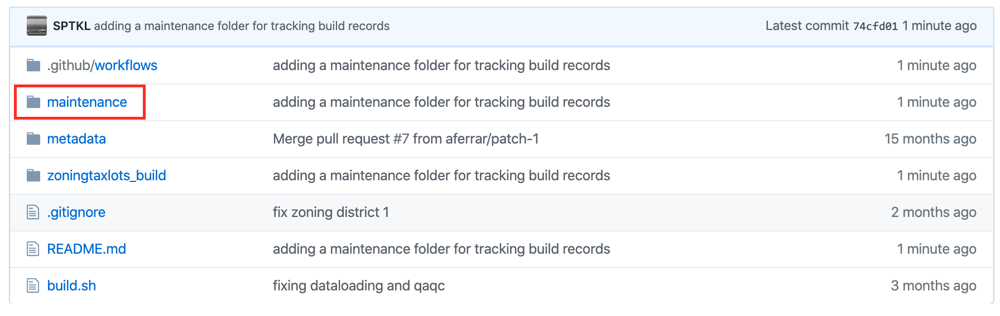
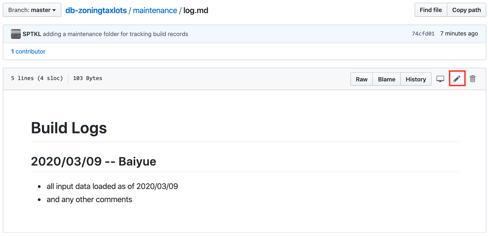
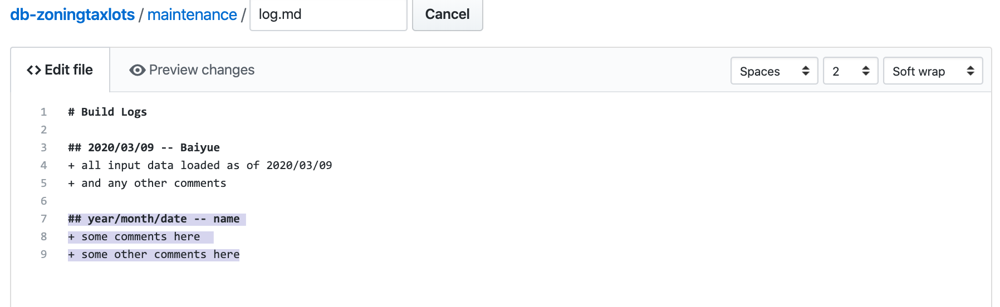
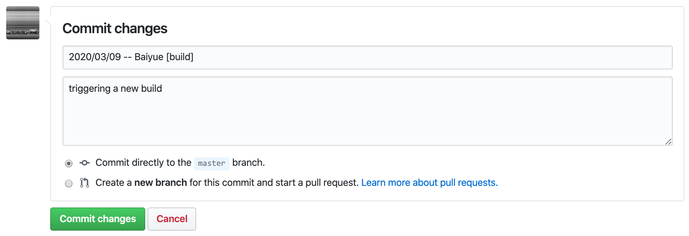
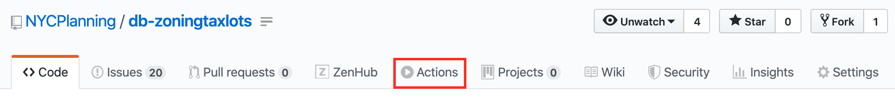
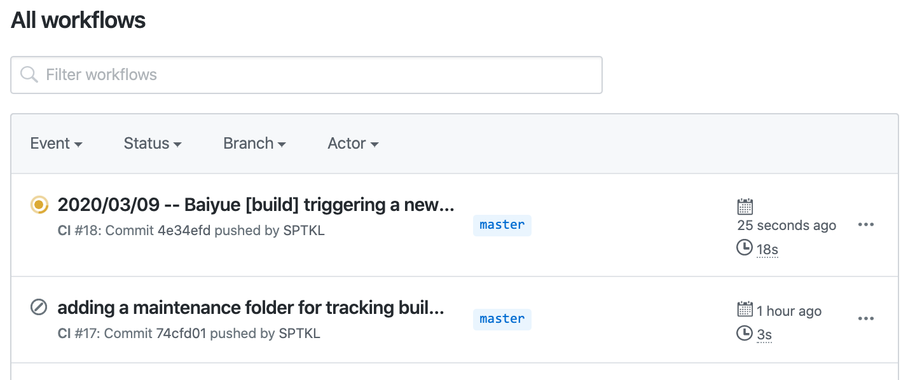
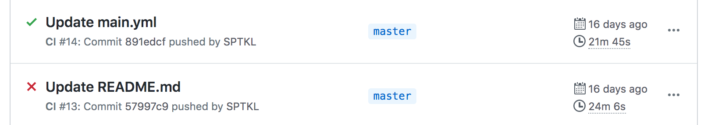
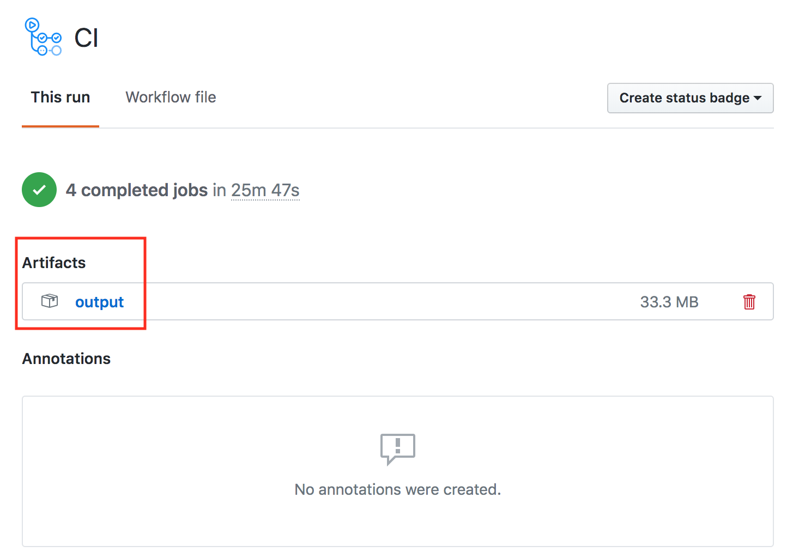

# Building Zoning Tax Lots
1. Data loading
2. Trigger a build
3. QAQC

***

## 1.  Data Loading 
(coming soon ...) 

***

## 2. Trigger a build
+ Once step 1 is complete, head over to the front page of the repository and navigate into the `maintenance` folder.

+ In `maintenance` you will see the following files: 
    + `instructions.md`
    + `log.md`
    
    We're going to edit the `log.md` file to trigger the build process.

+ To edit `log.md`, click on `log.md`, and then click the pencil button, which is highlighted by the red box in the image below

+ A file editor will pop open and now you can add a new entry to the end of the build log. Make sure you are following the format highlighted in the screenshot and provided below.
 

`## year/month/date -- name`
`+ some comments here`
`+ some other comments here`

+ Once you are done editing `log.md`, you are ready to commit the change to the `master` branch and trigger the build. To do this, scroll to the bottom of the page below the text editor to where it says "Commit changes."  **Give your commit a title and make sure that it included `[build]`** and enter an optional description.	It is important that you include `[build]` in the commit title so that github Actions will be triggered.  Github Actions is smart and will only trigger a build when `[build]` is mentioned in the commit title.

Select "Commit directly to master branch" and click __commit changes__

 

+ Now head to github actions by selecting "Actions" in the main banner.

+ You will see that a new build of zoningtaxlots has been triggered.

+ When zoningtaxlots is done building confirm that the build was successful by making sure a green check appears next to the action.  If a red X appears reach out to a team member.

+ If the build was successful you're now ready to QAQC and then publish the data

***

## 3. QAQC

The Zoning Tax Lot Database is created monthly. It contains all BBLs in the current DTM, with the zoning that applies to that lot. Note that the DTM contains base BBLs, unlike MapPLUTO, which contains billing BBLs.
The dataset is created spatially, using the current zoning files.
Month to month changes are the result of

+ Rezoning
+ Lots being merged or split
+ Data cleaning – adjustments of zoning boundaries, changes to areas designated as parkland, etc.

Download the output data package by clicking into the build action, and then click on `output` under "Artifacts." 

Or navigate to [QAQC application](https://edm-data-engineering.herokuapp.com/)

### Review reports
Review the reports and if the values changed for a large number of records and the changes cannot be explained the data needs further review.

1) **qc_versioncomparison.csv** - Compares the value differences between this version and the previous version, showing the number of records with a change in value and the percentage of these fields that changed. **qc_versioncomparisonnownullcount.csv** reports the number of records that changed from null to a value or vice versa.  
2) **qc_frequencychanges.csv** – Shows how many records have non-null values for each field in the old and new version. Note that changes to the number of records with a value may result from changes to null values or from BBL changes.

### Map the changes
**qc_bbldiffs** – Contains the old and new values for BBLs with changes from the last version.

+ Layer qc_bbldiffs, the new zoning shapefiles, and the current Digital tax map onto a map. 
+ Sort qc_bbldiffs by BBL
+ Verify that the zoning changes for each BBL meet one of the following criteria:
	+ Recent zoning change
	+ Adjustment to boundary
	+ Change in tax lot 
+ Verify all lots in newly rezoned areas have new values

***

## 4. Publish
Copy the **zoningtaxlots_db.csv** file to the publishing location.  The **source_data_versions.csv** lists the versions of the input datasets used to create the latest zoningtaxlots_db and can be used to update the metadata.

The outputs are available to download from the ReadMe.